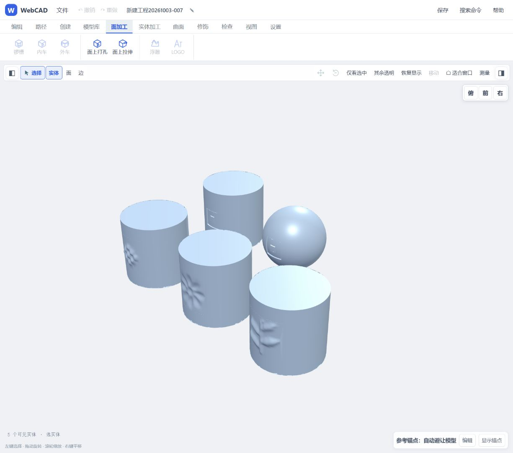
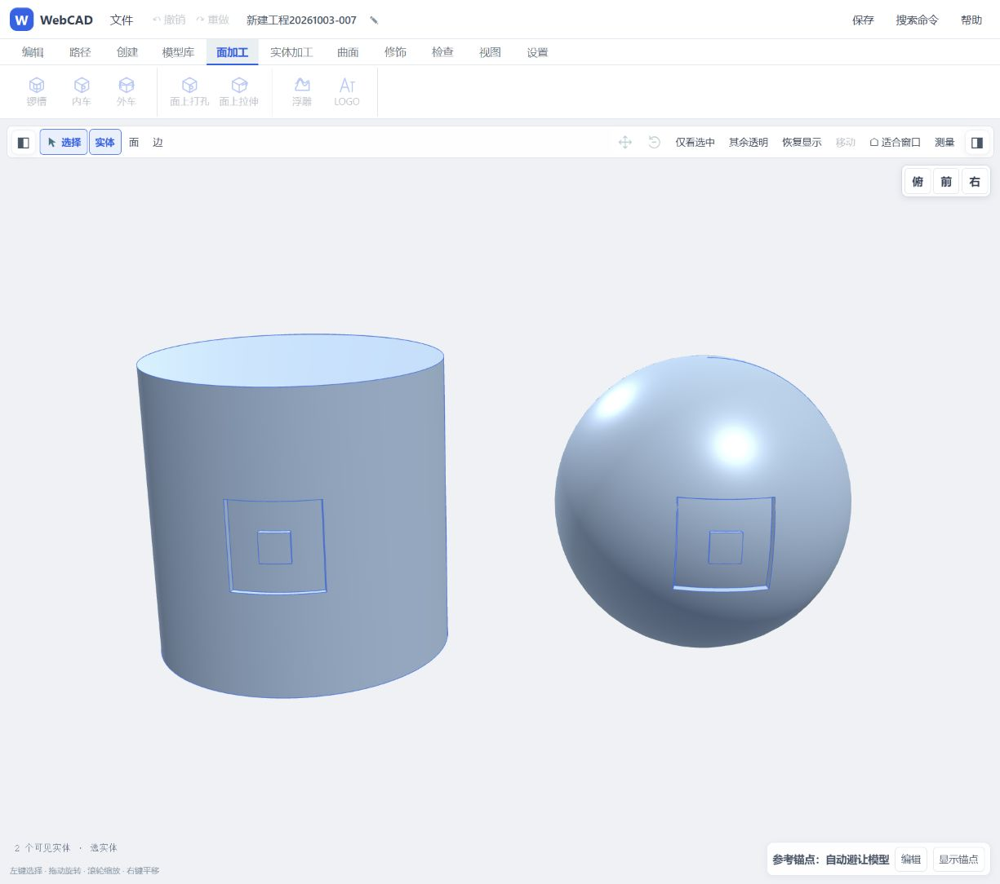
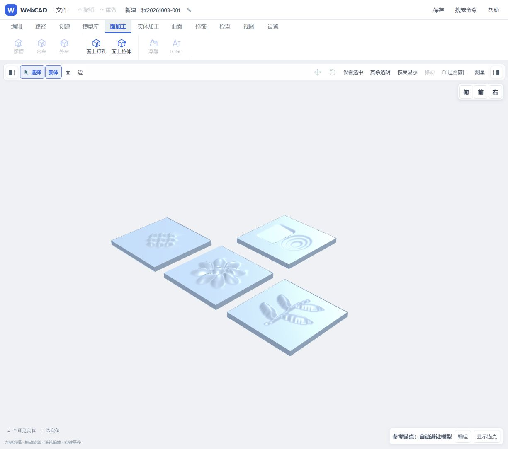

# 曲面浮雕与加工菜单：阶段成果

## 2026-10-03 曲面续做后的最终状态

用户追加要求检查 LOGO，并使两个工具支持曲面。现正式浮雕工具已从平面扩展到外凸圆柱面；LOGO 既有圆柱/球面/光滑放样面等深凹刻经内核回归，圆柱和球面还完成同页实测。这是确认原有 LOGO 能力，不冒充新功能。

柱面浮雕需要显式基底层（默认 0.02 mm、范围 0.005–1 mm），整张矩形先形成基底，再叠加图像高低；总控制高度=基底+图案起伏。它不是零背景贴花。水平为圆周弧长、垂直沿圆柱轴；放置点取实际选面点击坐标，支持旋转/平移后的柱体，图案自身旋转暂限0°。角宽≤90°，总高度≤半径20%，拒绝跨缝/孔/边界和内孔柱面。球面、自由曲面浮雕尚未开放；LOGO 曲面凸字/拔模也未开放。

| 最终曲面页面样件 | 实测材料变化 mm³ | 结果 |
|---|---:|---|
| JPG 波纹，柱面浮雕 | +106.070709 | 有效单实体 |
| SVG 花瓣，柱面凹雕 | -222.654458 | 有效单实体 |
| SVG 叶片，柱面浮雕 | +153.440225 | 有效单实体 |
| 圆柱面带内孔 LOGO | -102.096938 | 单实体凹刻 |
| 球面带内孔 LOGO | -101.865244 | 单实体凹刻 |

五件已保存并实际回读重开：`curved-relief-logo-demo-20261003.webcad`，30226 字节，SHA-256 `9b73ae2fd6e45148fbc11be9157665a3772f6551177833a7c06881f182e0830c`。5 实体/14 特征、重开前后精确体积一致，dirty=false；最终渲染身份和 revision 18 一致。证据：`relief-curved-browser-acceptance.json`、`curved-relief-logo-save-reopen.json`、`curved-relief-logo-final-state.json`。

最新专项测试 16 通过，浏览器 DOM/解码 20 项通过。新增独立解析验证：R=2/10/100 mm，凸/凹六例，恒高场材料变化与圆柱扇形公式 `0.5×角宽×轴向高×abs((R±h)²−R²)` 一致，误差门槛 max(1e-6 mm³, 理论体积×1e-8)，h=baseMm+depthMm。LOGO 独立脚本通过圆柱/球面/放样面0.3 mm法向深度、内孔保留、不伤背面、薄壁/接缝拒绝及STEP回读；统一内核 LOGO 4 项通过，日志 `logo-curved-review.log`、`logo-kernel-review.log`。最终构建门禁通过，contracts 281通过/1原有跳过/0失败。以下保留先完成的平面阶段证据。

## 已落地的产品功能

原“加工”分成“面加工”和“实体加工”。面加工直接提供锣槽、内外车、面孔/面凸台及浮雕/LOGO；实体加工保留孔槽螺纹、布尔和切分，三个批量工具集中在“更多”。旧工具没有删除，每项只有一个主菜单归属。

“面加工 → 浮雕”现提供本地 JPG/PNG/SVG 图片高度场。灰度和 SVG 渐变形成连续起伏，单色图形可按到背景的距离柔和鼓起。使用三次 B 样条生成精确 BREP，支持向外加料、向内凹雕、位置/旋转、预览、历史改高度和撤销；不是平顶凸字。

平面阶段要求单一闭合实体和整个图案矩形位于有限选面内且避开孔；后续柱面扩展见上文。高度是平滑控制上限，灰度不是照片真实三维深度。大幅凹雕可能穿透，需核对预览。

UI 和 AI 共用操作：`files.register` → `readRelief` → `run add relief`；通过 `getState().bodies[].reliefReport` 读回实际材料变化。工程参数内保存高度网格和来源哈希，重建无需原图。

## 已执行的真实页面流程

执行通道：同一个 Codex IAB 页面的授权 CDP → `window.webcad.api`，同一浏览器 Worker 串行执行。所有尺寸均为本轮自建测试件，不是源产品尺寸。

| 图案 | 模式与网格 | 几何回读 | 实测结果 |
|---|---|---|---|
| JPG 波纹 | 浮雕，33×33，控制高 2 mm | 单一有效实体 | 增加 216.164700 mm³ |
| SVG 渐变花瓣 | 浮雕，49×49，控制高 3 mm | 单一有效实体 | 增加 728.902969 mm³ |
| SVG 单色叶片 | 柔和鼓起，49×49，控制高 2.5 mm | 单一有效实体 | 增加 337.232540 mm³ |
| SVG 渐变与灰阶层次 | 凹雕，65×43，控制深 1.5 mm | 单一有效实体 | 去除 352.480566 mm³ |

以上均为 2026-10-03 00:16 左右加载最终源码后的页面实测。第四例原始 viewBox 为 3:2，实际尺寸为 32 × 21.333333333333332 mm；已修复早期栅格取整导致的比例漂移。

页面同时验证：重复请求不重复建模；失败不改变修订；历史修改起伏高度后实际体积改变；撤销还原浮雕；凹雕撤销回到底板，重做恢复同一体积。最终四实体的 rendered/model/context 均为 revision 17。

单批回执曾出现 `display.status=rendered` 但 `displayMatchesContext=false`，不能据此认定当前帧已完成。上述结论使用最终 `redraw/getState` 的实际 rendered revision 与 context 对照。

细节回执：`relief-browser-acceptance.json`、`relief-engrave-acceptance.json`；早期 UI 导入 JPG → 预览 → 应用截图：`relief-first-ui.png`。

## 算法与回归

- 产品实现前先用三张自行编码、重新解码的 JPEG 试算。三次控制样条方案生成有效单实体且来源 BREP 不变；记录 `relief-probe-results.json`。
- 最新目标回归覆盖契约、图片头尺寸检查、坐标方向/透明度/明暗、曲面与凹雕、越界/孔/曲面/空图拒绝、独立散面拒绝、来源不变、JSON 网格重建、历史更参后失败不改缓存实体、菜单完整性。
- 停止开发服务后最终完整 contracts：281 通过、1 原有跳过、0 失败。先前 Windows 安装器 stage 移动 AccessDenied 在停服务后消失；仅证明与服务运行状态相关，不冒充已精确定位到某个进程锁。
- 最终浏览器独立 DOM/解码测试 18 项通过：真实 SVG 渐变解码、精确比例、绝对单位、超大尺寸和外部资源拒绝、损坏图片拒绝、改参使预览失效、应用失败留在任务中等，记录 `relief-dom-tests.json`。
- `npm.cmd run build` 已通过发布门禁 75 operations / 28 actions / 160 UI routes；最终构建时间和最后改动的对应关系见交接记录。

## 柱面试算历程与产品化依据

`agent/temp/relief-cylinder-probe.mjs` 构造精确有理圆柱基面，升阶并插入结点后按图案改变径向控制高度，使用相同边界构成封闭工具并做实体布尔。

三张 JPEG × 浮雕/凹雕 + 零高度对照，7 例通过。单例约 194–614 ms；均有效单实体，源 BREP 字节不变。51×51 采样的圆柱基面半径偏差约 1.42e-14 mm；零高度对照体积变化约 3.64e-11 mm³。记录 `relief-cylinder-probe.json`。

另有 `relief-cylinder-footprint-probe.mjs` 的 7 项边界试算通过：实际圆柱轴、平移旋转、有限面内、跨接缝/端面/完全越界、足迹内部孔和内孔柱面区分。随后合并原型发现无基底的零高区域在刚体变换后出现布尔失败；负向微间隙也未达到0.001 mm³不变性门禁，因此没有采用。明确0.02 mm矩形基底后，三图×两模式×原/变换体共12个实体通过，体积差≤1.46e-11 mm³。记录 `relief-cylinder-combined-probe.json`。成功后才集成 `src/modeling/manufacturing/cylindrical-relief.js`、UI/AI和文档，再做上述真实页面验收。离散高度采样不等于完整曲面误差证明。

## 参考与交付边界

参考了 [FreeCAD Lithophane](https://github.com/furti/FreeCAD-Lithophane) 的亮度高度场路线，以及 [OpenSCAD surface](https://github.com/openscad/openscad/blob/master/src/core/SurfaceNode.cc) 的高度场闭合思路；没有复制项目源码。柱面试算参照 [OCCT B 样条曲面 API](https://lwv.occt3d.com/dev/doc/refman/html/class_geom___b_spline_surface.html) 的升阶、插结点和控制点接口。

用户补充授权后，四件示例已无弹窗保存为 `agent/output/relief-demo-20261003.webcad`（112757 字节，SHA-256 `0998017f2399b0b51f7f7c29af7b3acff6e65877a5c8df5b4226501173850f24`）。实际写盘、回读校验后调用 `files.confirmWritten`；再把读回字节经 `files.register/open` 打开，四个实体精确体积与保存前相同，12 个特征保留，dirty=false。重开后的最终 rendered/model/context 均为 revision 18。证据：`relief-save-reopen.json`、`relief-final-state.json`。

本轮区分源码提交、构建、浏览器内存几何、渲染和落盘。生产 IIS 副本没有部署。继续工作入口：`agent/notes/RELIEF-HANDOFF-20261002.md`。
